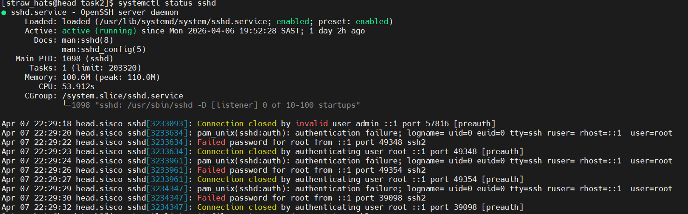
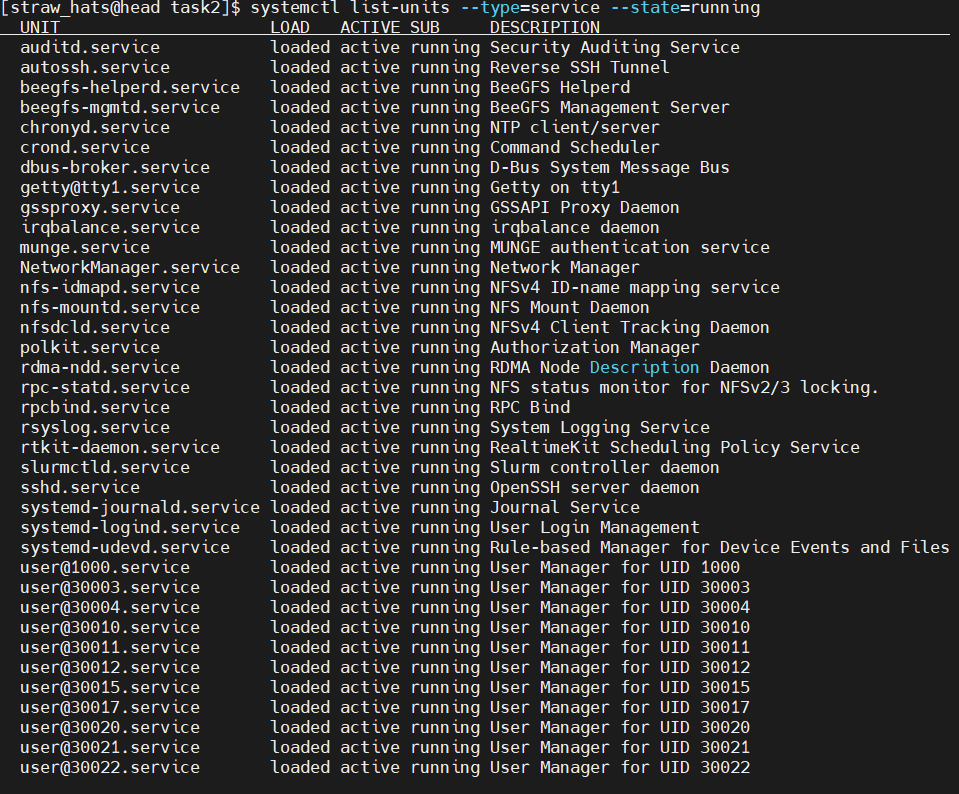
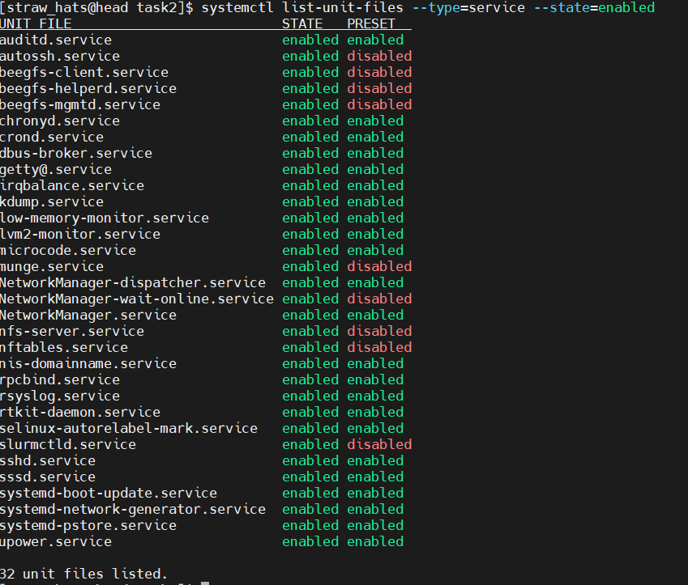
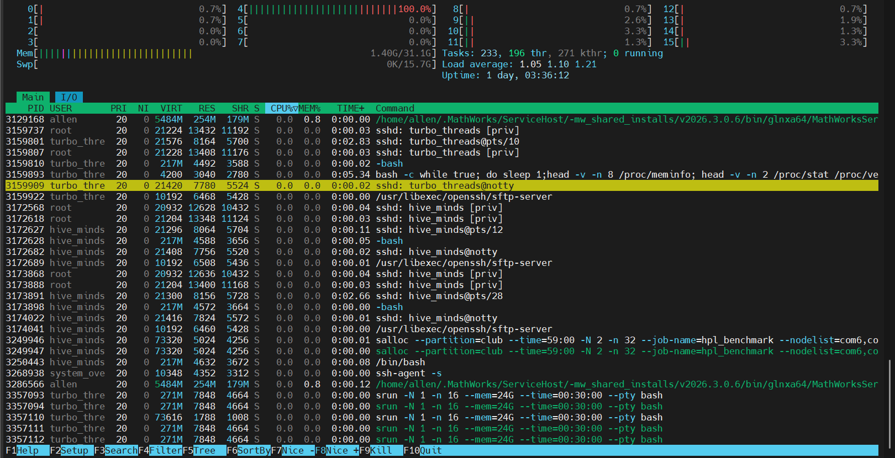
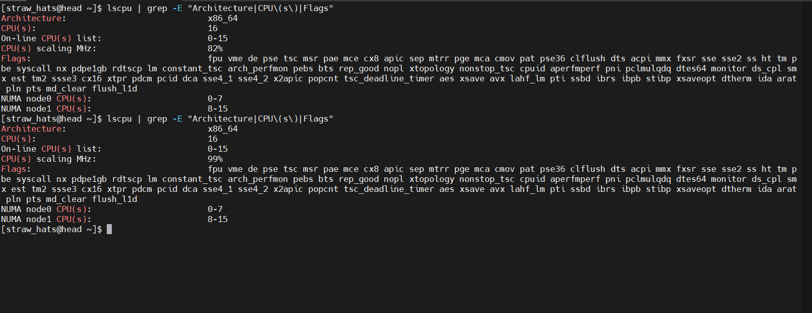

# Task 2 - System Information

## 1. SSH Service Status

### Command
```bash
systemctl status sshd
```

### Output
```bash
● sshd.service - OpenSSH server daemon
     Loaded: loaded (/usr/lib/systemd/system/sshd.service; enabled; preset: enabled)
     Active: active (running) since Mon 2026-04-06 19:52:28 SAST; 22h ago
```

### Screenshot



## 2. Running Services

### Command
```bash
systemctl list-units --type=service --state=running
```

### Output
```bash
  auditd.service           loaded active running Security Auditing Service
  autossh.service          loaded active running Reverse SSH Tunnel
  beegfs-helperd.service   loaded active running BeeGFS Helperd
  beegfs-mgmtd.service     loaded active running BeeGFS Management Server
  chronyd.service          loaded active running NTP client/server
  crond.service            loaded active running Command Scheduler
  dbus-broker.service      loaded active running D-Bus System Message Bus
  getty@tty1.service       loaded active running Getty on tty1
  gssproxy.service         loaded active running GSSAPI Proxy Daemon
  irqbalance.service       loaded active running irqbalance daemon
  munge.service            loaded active running MUNGE authentication service

```

### Screenshot



## 3. SSH process 

### Command
`htop`

### Screenshot


## 4. CPU details

### Command
`lscpu | grep -E "Architecture|CPU\(s\)|Flags"`

### Screenshot


## 5. SSH logs

### Command
`journal
